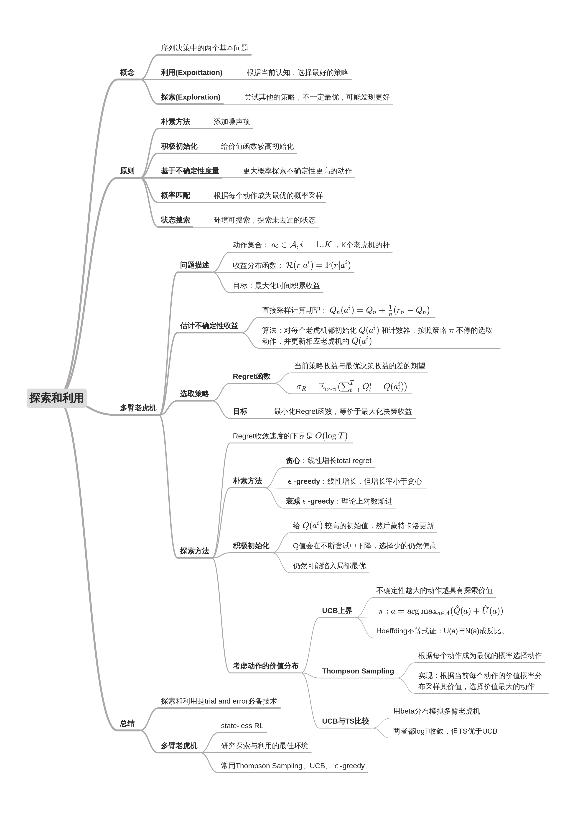
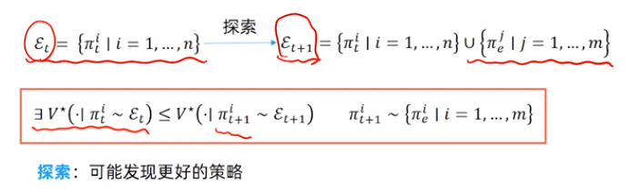
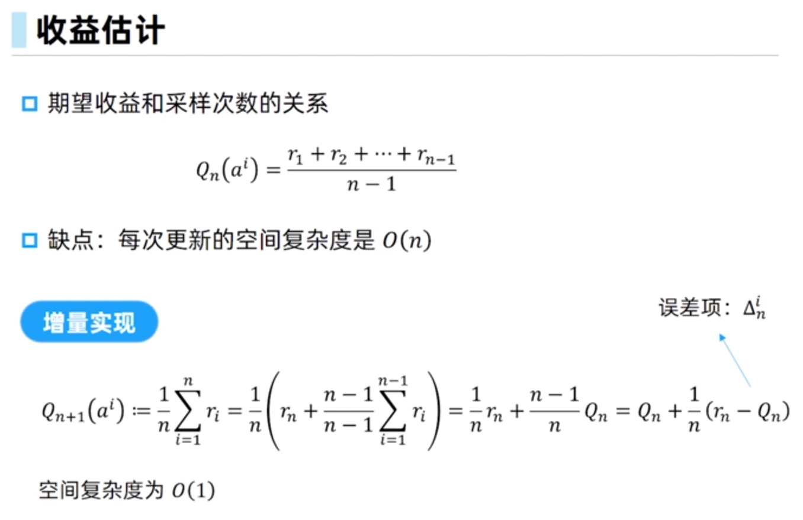
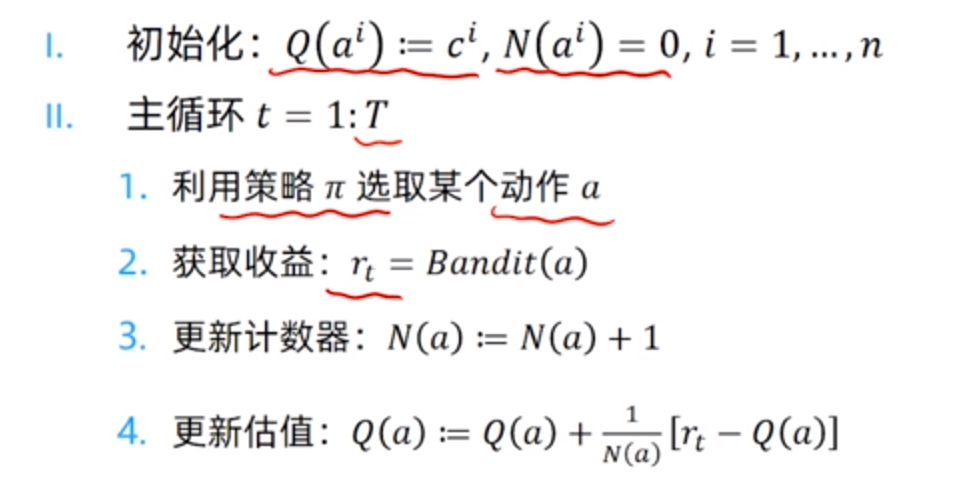
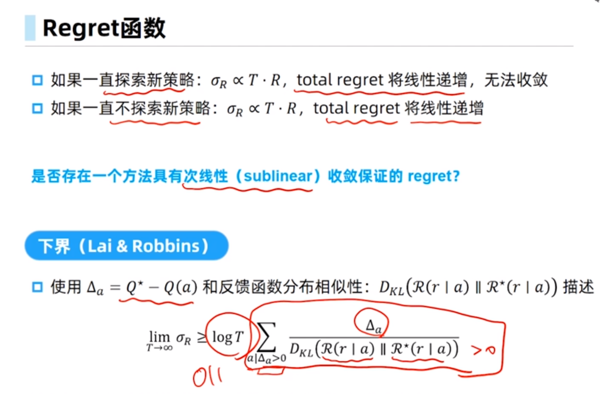
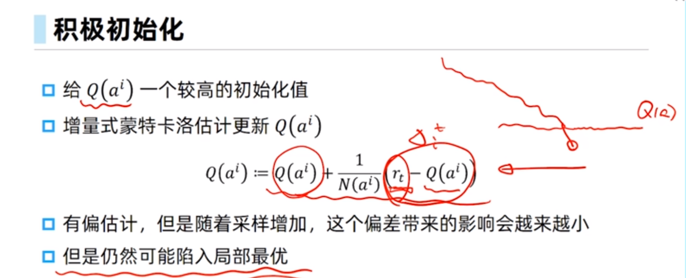

#探索与利用

基于目前策略获取已知最优收益还是尝试不同的决策



策略探索的一些原则：
- 朴素方法 添加噪声
- 积极初始化
- 基于不确定性的度量
- 基于概率匹配

# 多臂老虎机问题

#### 1. 问题定义

这是一种试错型学习(trial-and-error learning),多臂老虎机不存在状态信息,只有**动作**和**奖励**,如何权衡**探索**和**利用**是一个特别经典的问题

问题定义：有一个拥有**K根拉杆**的老虎机，拉动每一根拉杆都对应着一个**关于奖励的概率分布R**。我们每一次拉动其中一根拉杆，就可以从拉杆对应的奖励概率分布中**获得一个奖励r**。我们**在各根拉杆的奖励概率分布未知**的情况下，从头开始尝试，目的是在操作**T次**拉杆后获得**尽可能高的累积奖励**。

由于奖励的概率分布是未知的，因此需要**balance “探索”和“根据经验”**


```
argmax( Q(a) ) -> argmin( Q(最优拉杆) - Q(a) ) -> argmin( Reget )
```

目标：最大化累积奖励 == 最小化懊悔

#### 2. 增量更新奖励期望



#### 3. 算法流程




#### 4. Regret



积极初始化，我们认为每个杆子都有概率被认为是较优选择，然后对于贪心解，我们会让他的Q值渐渐降下来，而对于没有被探索的解，由于我们积极初始化，因此起到了可以探索没有被探索的一个效果


