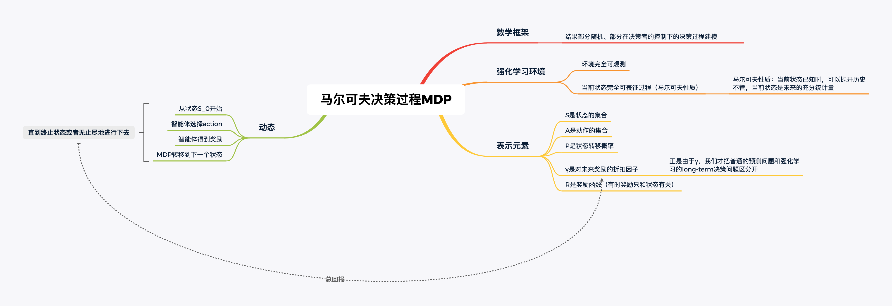
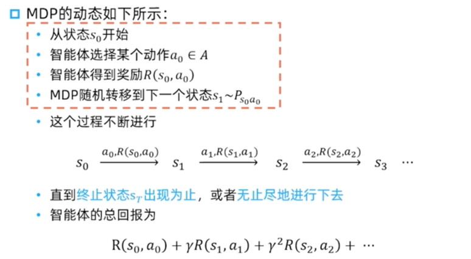
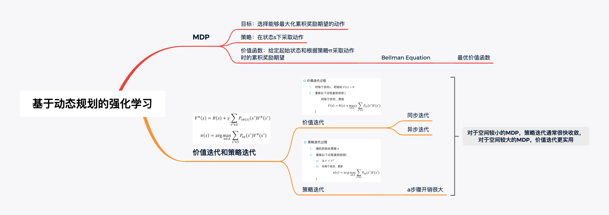
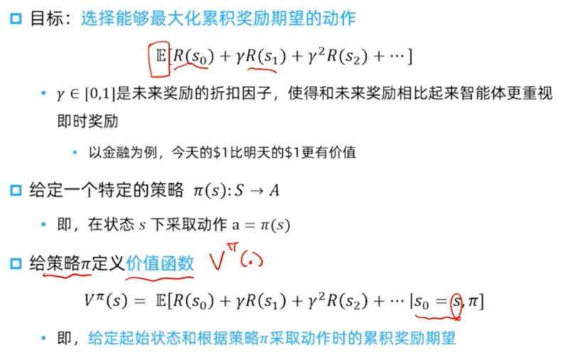
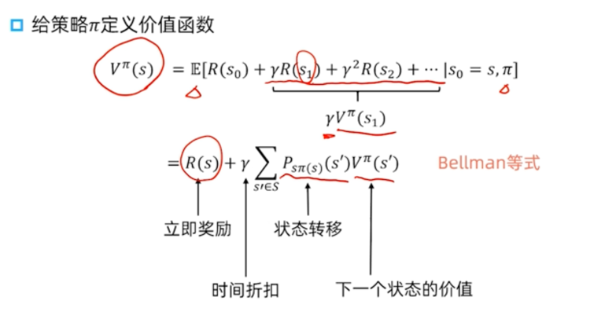
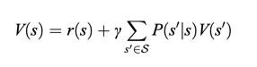
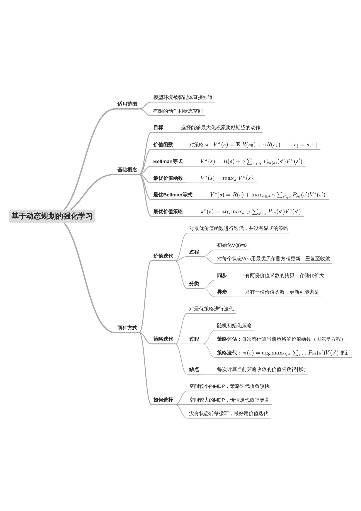
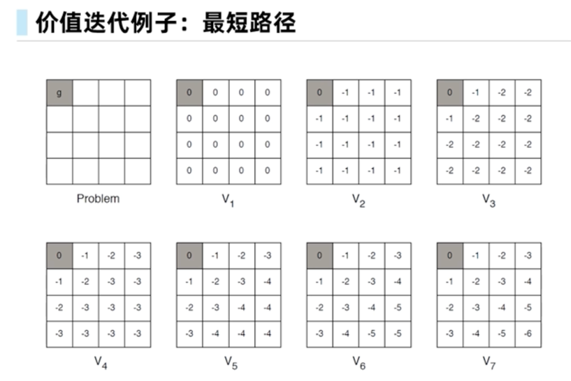
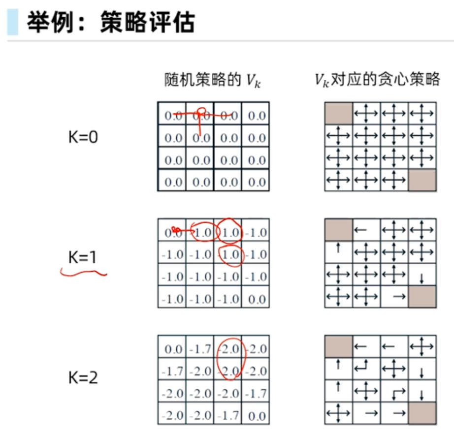
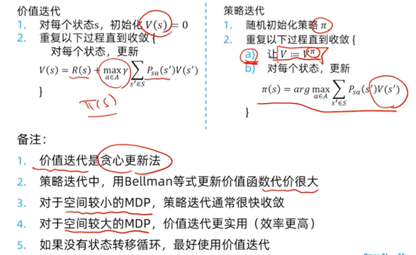

### 马尔可夫决策过程（MDP）

#### 基本概念

结果部分随机、部分在决策者的控制下的决策过程建模

在大部分情况下，**奖励只和状态相关**

比如在迷宫游戏中，奖励只和位置相关；在围棋中，奖励只基于最终所围地的大小有关

#### MDP目标和策略

在**价值函数**中，一方面，即时奖励的期望正是奖励函数的输出，即立即奖励；另一方面后面部分即是根据从状态s出发的转移概率得到；

### 基于动态规划的强化学习

补充：

最优价值函数：对状态s来说的最优价值函数是**所有策略可以获得的最大可能的折扣奖励的和**

